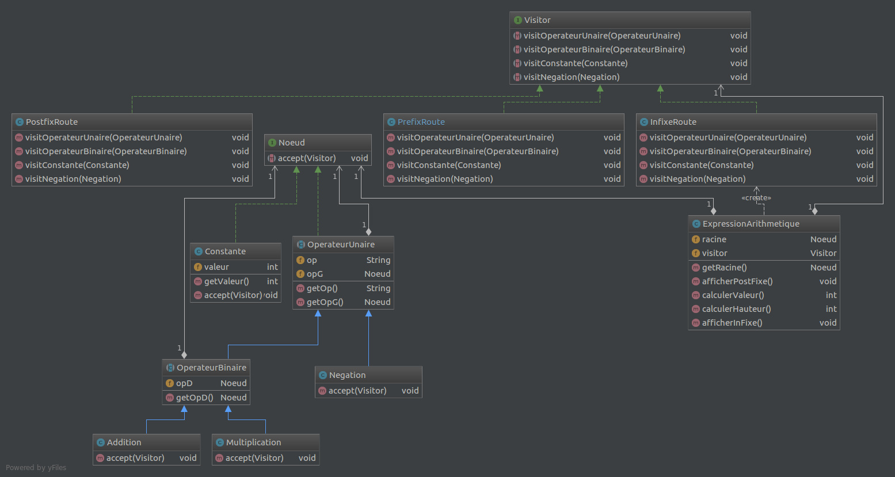

**Nom/Prénom Etudiant 1 : Yoann Lathuilière**

**Nom/Prénom Etudiant 2 : Yannick Montes**

# Rapport TP2

## Question 1

L'implémentation du pattern visiteur est une manière de répondre au problème posé au sein du TP.
Voici le diagramme de classe:


On créer une interface Visiteur. Cette dernière possède toutes les fonctions nécéssaires à la visite d'un noeud en particulier (Opérateur unaire, binaire ou une constante).

Par la suite, on créer des classes Visiteurs concrètes, représentant chacun un type de parcours spécifique au sein de l'arbre. Elles implémentent l'interface visiteur afin de surcharger les méthodes précédement définies.

Enfin, un noeud possède une méthode accept(), lui permettant d'être visité par quelconque type de visiteur. 
Le traitement de cette fonction est très simple, il appelle la méthode de visite spécifique à son type. 
Un exemple avec la classe Addition: 
```java
public void accept(Visitor visitor)
{
    visitor.visitOperateurBinaire(this); // This représente une Addition.
}
```

L'intérêt du pattern est d'avoir à modifier qu'un seul fichier en cas d'ajout d'une méthode de parcours. 
En revanche, si l'on ajoute un élément, il faut modifier tous les fichiers.

*Expliquer pourquoi ça plutôt que le pattern stratégie*


## Question 2
*Expliquer le code ajouté*

## Question 3
*Expliquer le code ajouté*

## Question 4
*Expliquer le code ajouté*

## Question 5
*Expliquer le code ajouté*

## Question 6
*Expliquer le code ajouté*
